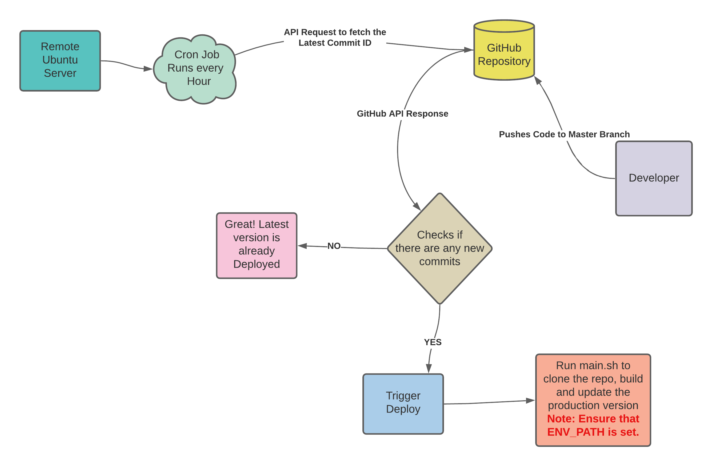

# Official Website of CDCRC, IIT Ropar 

## About

The following repository contains the source code of the official website of Career Development and Corporate Relations Center, IIT Ropar.

## Development setup without Docker
Before proceeding further, ensure that you have `python3` and `PostgreSQL` installed on your computer! In case you don't, you can download python3 from [here](https://www.python.org/downloads/).

1. Clone the repo and change the directory.
2. Now install all dependencies.
```bash
pip install -r requirements.txt
```
> The root directory should have a file named `.env.example`. Before proceeding to the next step, you must make a .env file and fill in all the values mentioned. Alternately, you may add all these values in your `.bashrc` script too.
3. Change the directory into `src/`.
```bash
cd src/
```
4. Now, run the following command to make migrations corresponding to the models in the project.
```bash
python manage.py makemigrations
```
5. Migrate the changes into the database.
```bash
python manage.py migrate
```
6. Now, run the development server with the following command.
```bash
python manage.py runserver
```
7. Congrats! Now you are all set to contribute! 🎉🎉


## Development setup with Docker
The development setup with `docker` is pretty straightforward. All you need to do is put proper values in the `.env` file. It will automatically make a db admin in the postgres database based on the values in the `.env` file.


1. After cloning the repo, run the following command to build the container and mount appropriate volumes.
```bash
docker-compose build
```
2. Now start the containers with the following command.
```bash
docker-compose up
```
> It will start the backend server at [localhost:8000](http://localhost:8000).
3. You may use the following command to stop the containers.
```bash
docker-compose down
```

## Production Deployment using Docker
Here too, with `docker`, things are fairly straightforward. Before moving futher,ensure that you have put appropriate values in the `.env` file.

1. After cloning the repo, run the following command to build the container and mount appropriate volumes.
```bash
docker-compose -f docker-compose.prod.yml build
```
2. Now start the containers with the following command.
```bash
docker-compose -f docker-compose.prod.yml up
```
> It will start the backend server at [localhost:8000](http://localhost:8000).
3. You may use the following command to stop the containers.
```bash
docker-compose -f docker-compose.prod.yml down
```

## Continuous Integration Logic

Here a pictorial overview of the continuous integration. Please note that the team doesn't have `ssh` access to the system. Suggestions are welcome to improve the existing design.



### Scripts

These are the following scripts which are used in the `prod`.
<table>
    <tr>
        <td><b>Script Name</b></td>
        <td><b>Function(s)</b></td>
    </tr>
    <tr>
        <td>
            <a href="./startup.sh">startup.sh</a>
        </td>
        <td>
            <ul>
                <li>startup.sh is responsible for making migrations files corresponding to the models and then apply them to the database.</li>
                <li>It also collects the static assets and pushes them into the mounted docker volume.</li>
                <li>At last, it creates the superuser using the specified environment variables if there isn't any. </li>
                <li>Ensure that all the containers are running before using this script.</li>
                <li>Ideally, we should run this just after we run the containers. And we should run it once per deployment.</li>
            </ul>
        </td>
    </tr>
    <tr>
        <td>
            <a href="./prod/main.sh">prod/main.sh</a>
        </td>
        <td>
            <ul>
                <li>main.sh is responsible for checking if the COMMIT ID of the remote repo changed. If yes, it clones the repository, builds it and starts the application.</li>
                <li>It calls to startup.sh in the end</li>
            </ul>
        </td>
    </tr>
<table>


## Contributing
This project is open for contribution, but we would request you to kindly open issues and comment on the discussion thread before working on anything. We also expect you to write proper documentation, which will ensure that the future team doesn't face any issues.
